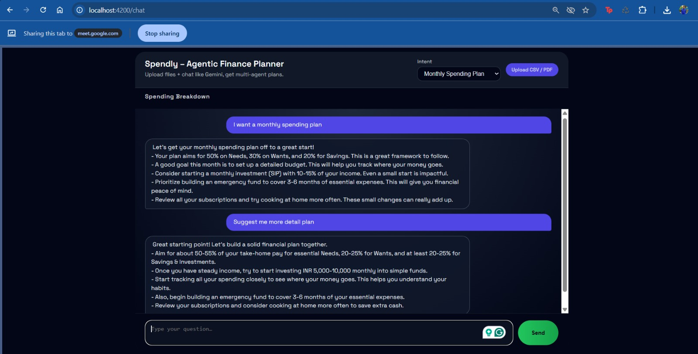
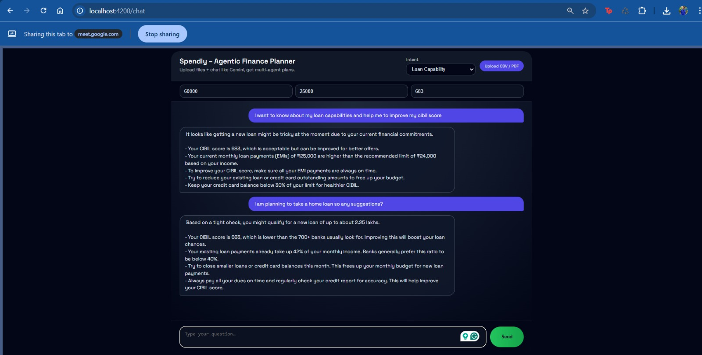

## Spendly – Agentic Personal Finance Planner (POC)

Spendly is a hackathon‑grade, multi‑agent **personal finance planner** that feels like chatting with a smart banking copilot.  
Users talk to a single chatbot, upload bank statements / payslips, and Spendly’s domain agents collaborate to produce **spending plans, tax optimisation hints, investment allocations, and loan eligibility estimates**.

Built with:
- **Backend**: FastAPI + Gemini + simple LangGraph‑style orchestration
- **Frontend**: Angular 15 single‑page chatbot UI
- **Storage**: Local JSON session store + `/uploads` folder (no DB)

---

## 1. Problem Statement

Most people in India:
- Track money only at tax time or when credit card bills hurt.
- Don’t know if their spending patterns are healthy.
- Don’t understand which tax regime they should pick or which deductions they are missing.
- Are unsure how much surplus they can safely invest or how much loan they can actually afford.

Existing tools are either:
- **Too heavy** (full ERPs, complex dashboards, need bank integrations), or  
- **Too shallow** (one‑shot calculators with no context and no conversation).

**Spendly** solves this by giving users:
- A **chat‑first interface** (Gemini‑style) where they can ask in natural language.
- **Lightweight uploads** (CSV bank statement, PDF payslip) instead of full integrations.
- **Agentic reasoning** – multiple domain agents specialising in parsing, spending, tax, investment, and loan logic, orchestrated by a central controller.

The goal of this POC is not perfect financial advice, but a **credible demo** of how a real product could work.

---

## 2. High‑Level Architecture

- **Frontend (Angular 15)**
  - Single chatbot page at `http://localhost:4200`
  - Intent selector: `Spending Plan`, `Tax Saver`, `Investment Planner`, `Loan Capability`
  - File upload (CSV / PDF) and CIBIL / income inputs
  - Chat bubbles with a **typing / streaming effect**
  - Simple visual for category‑wise spending (horizontal bar chart)

- **Backend (FastAPI)**
  - Entrypoint: `backend/app/main.py`
  - Endpoints:
    - `GET /health` – health check
    - `POST /upload` – upload CSV/PDF, stored under `/backend/uploads`
    - `POST /chat` – main orchestrator endpoint used by the chatbot
  - Orchestrator: `backend/app/orchestrator.py`
    - Routes each turn to one of the domain agents based on the selected intent
    - Maintains lightweight conversational state in JSON session files

- **Domain Agents**
  - `Document Parser Agent`
  - `Spending Plan Agent`
  - `Tax Agent`
  - `Investment Agent`
  - `Loan Agent`

- **LLM**
  - Google Gemini (Flash / Pro, via `google-generativeai`)
  - All agents use **strong guardrails** in prompts:
    - No hard promises, numbers are “rough” and “for education”
    - No specific stock picks, banks or investment apps
    - Plain‑text only (no markdown), to keep UI rendering clean

---

## 3. Features & Agent Responsibilities

### 3.1 Document Parser Agent

**Input**
- Bank statement in CSV format.
- Payslip in PDF (simple text extraction or OCR; POC uses basic parsing).

**Logic**
- Bank CSV:
  - Parse into a list of transactions.
  - Auto‑categorise transactions using simple keyword rules:
    - `"Zomato"`, `"Swiggy"` → `Food`
    - `"Uber"`, `"Ola"` → `Transport`
    - `"Rent"` → `Rent`
    - `"EMI"` → `EMI`
  - Any unknown descriptions are sent to LLM for category suggestion.
  - Approximate **monthly income** (sum of positive credits).
  - Derive a naive **emergency fund** suggestion (e.g. 25% of monthly income).

- Payslip (PDF → text):
  - Extract rough values for `Basic`, `HRA`, `PF`, `Tax` using regex.
  - Compute approximate income and structure `payslip_info`.

**Output (simplified example)**

```json
{
  "income": 65000,
  "transactions": [
    { "date": "2024-12-02", "desc": "Zomato", "amount": -600, "category": "Food" }
  ],
  "emergencyFund": 15000,
  "payslip_info": {
    "basic": 40000,
    "hra": 15000,
    "pf": 3600,
    "tax_deducted": 5000
  }
}
```

### 3.2 Spending Plan Agent

**Goal:** Turn a raw transaction list into **budget insight + red flags + suggested plan**.

- Computes:
  - Income vs. total expense
  - Category‑wise totals and % share
- Red‑flag rules (simple but believable):
  - Food > 20% of expenses → “High food delivery / dining”.
  - EMI > 40% of income → “High EMI burden”.
  - Emergency fund < 2 × monthly income → “Low emergency fund”.
- LLM generates:
  - One‑line assessment.
  - Plain‑text bullets for:
    - Ideal budget split (broad buckets).
    - Suggested SIP amount.
    - 4–6 lifestyle adjustments.

### 3.3 Tax Agent

**Two‑phase flow:**
1. **Clarifying questions**:
   - “Do you pay rent? City + amount?”
   - “Do you have health insurance? Premium per year?”
   - “Any home / education loan? EMI and interest?”
2. **Comparison**:
   - Roughly computes old vs new regime tax.
   - Analyses six key buckets:
     - 80C, 80D, HRA, home loan interest, standard deduction, PF.
   - Responds with:
     - Which regime is likely better and why.
     - Which buckets are under‑used.
     - 3–5 clear “do this next year” bullets.

Prompts explicitly say this is **not official tax advice**, just educational guidance.

### 3.4 Investment Agent

**Input:** Surplus from spending analysis (income – expenses).

**Logic:**
- Ensure minimum 3‑month emergency fund before investing heavily.
- Allocate investible surplus into:
  - 60% equity SIP (index fund / broad equity)
  - 20% debt / FD
  - 10% gold
  - 10% liquid fund
- Uses mock 1‑year returns in code as **illustrative, not predictive**.

**Output:** Plain‑text explanation of:
- Why the split makes sense.
- How to build emergency fund in parallel.
- Simple action plan for “what to start this month”.

### 3.5 Loan Agent

**Inputs:** Monthly income, existing EMIs, CIBIL score.

**Logic:**
- Max EMI ≈ 40% of income – existing EMIs.
- Approximate loan amount = Max EMI × 60 (5‑year tenure) at 12% interest.
- CIBIL heuristics: “good” if ≥ 700, otherwise caution.

**Output:**  
One‑line “you can roughly afford X”, plus:
- Whether CIBIL is generally acceptable.
- Safe vs risky EMI bands.
- 3–4 tips to improve approval chances.
- A reminder not to over‑stretch EMIs.

---

## 4. End‑to‑End User Flow (Demo Script)

1. **User lands on Spendly UI**  
   - Sees a Gemini‑style chat window.
   - Chooses an intent from the dropdown (e.g. **Monthly Spending Plan**).

2. **Spending Plan demo**
   - User: “I want a monthly spending plan.”  
   - Uploads `bank.csv`.  
   - Parser Agent extracts ~100+ transactions.  
   - Spending Agent flags:
     - Food > 20%,
     - High EMI,
     - Low emergency fund.  
   - UI shows:
     - Assistant reply typing out.
     - Category‑wise bar chart for spending.

3. **Tax Saver demo**
   - Switch intent to **Tax Saver**; upload payslip PDF.  
   - System asks 3 questions (rent, health insurance, loans).  
   - After answers:
     - Compares old vs new regime.
     - Lists missing deductions (80C/80D/HRA/etc.).
     - Gives a short plain‑text action plan.

4. **Investment Planner demo**
   - Uses same bank data.
   - User: “How should I invest my surplus each month?”  
   - Investment Agent suggests a 60/20/10/10 split, explains emergency fund priority and next steps.

5. **Loan Capability demo**
   - Switch intent to **Loan Capability**.  
   - Enter monthly income, existing EMIs, and CIBIL score.  
   - Loan Agent answers:
     - Rough loan amount they can afford.
     - Whether their CIBIL is good enough.
     - Tips to improve approval chances.

---

## 5. Running the Project Locally

### 5.1 Backend (FastAPI + Gemini)

From the `Spendly/backend` directory:

```bash
python -m venv .venv
.\.venv\Scripts\activate
pip install -r requirements.txt

# Set your Gemini API key (PowerShell example)
$env:GOOGLE_API_KEY = "YOUR_GEMINI_KEY"

uvicorn app.main:app --reload --port 8000
```

Health check:

```bash
curl http://localhost:8000/health
```

### 5.2 Frontend (Angular 15)

From the `Spendly/frontend` directory:

```bash
npm install

# Ensure Angular CLI 15 is available
npm install -g @angular/cli@15

ng serve --open
```

This opens `http://localhost:4200` with the Spendly chat UI.

---

## 6. Project Structure (Key Files)

- `backend/`
  - `app/main.py` – FastAPI app and HTTP endpoints.
  - `app/config.py` – Settings (Gemini model, paths).
  - `app/llm_client.py` – Gemini wrapper with prompt guardrails.
  - `app/orchestrator.py` – Single‑turn orchestrator calling domain agents.
  - `app/session_store.py` – JSON session persistence.
  - `app/agents/`
    - `document_parser.py`
    - `spending_agent.py`
    - `tax_agent.py`
    - `investment_agent.py`
    - `loan_agent.py`

- `frontend/`
  - `src/app/chat/chat.component.*` – Chatbot UI + streaming effect.
  - `src/app/chat.service.ts` – HTTP client for `/upload` and `/chat`.
  - `src/styles.scss` – Global dark theme.

---

## 7. Screenshots

- **Monthly Spending Plan (Spending Plan with Category Bars)**  
  

- **Loan Capability Result**  
  

